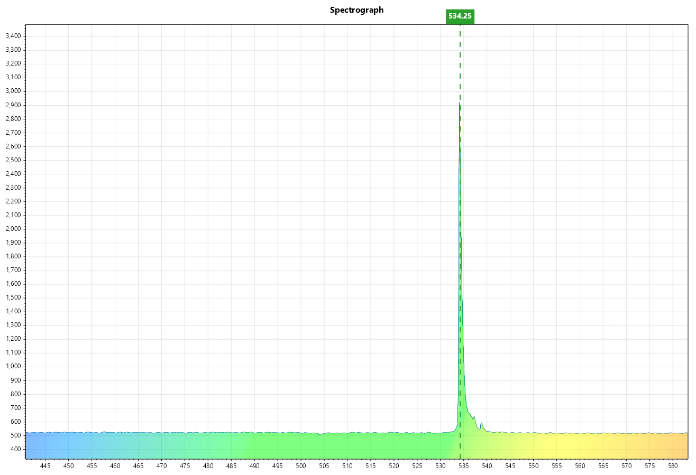

# SpectrographWPF
基于WPF实现的光谱仪上位机软件

## 1. 程序功能
- 串口连接
- 串口数据接收&发送
- 光谱数据绘图
- 寻峰
- 光谱积分
- 暗场
- 波长校准

## 2. 程序界面

## 3. 需求
- .NET 8.0
- 虚拟串口驱动

## 4. 使用
1. 安装.NET 8.0运行环境（第一次启动时会弹出.net8的下载）和虚拟串口驱动
2. 下载最新的Release版本
3. 解压后运行`SpectrographWPF.exe`
4. 查找串口后，选择串口号，点击`打开串口`
5. 点击右下角的`开始`或`单次`按钮，开始接收数据	

## 5. 参数设置
- 导出数据：左上角的`文件`选项卡中选择`导出数据`，输出csv文件
- 暗场导入：左上角的`文件`选项卡中选择`导入暗场`，选择暗场文件。勾选左侧`暗场`选项以应用暗场
- 积分: 勾选左侧`积分`选项，点击右下角的`开始`按钮，开始积分
- 寻峰: 勾选左侧`寻峰`选项以应用寻峰，或点击左侧的`寻峰`按钮进行单次寻峰
- 波长校准: 调节左侧的千分尺和偏移数据以进行波长校准

> [!IMPORTANT]  
> 目前没有使用MVVM模式，后续会进行重构(~~大概~~)